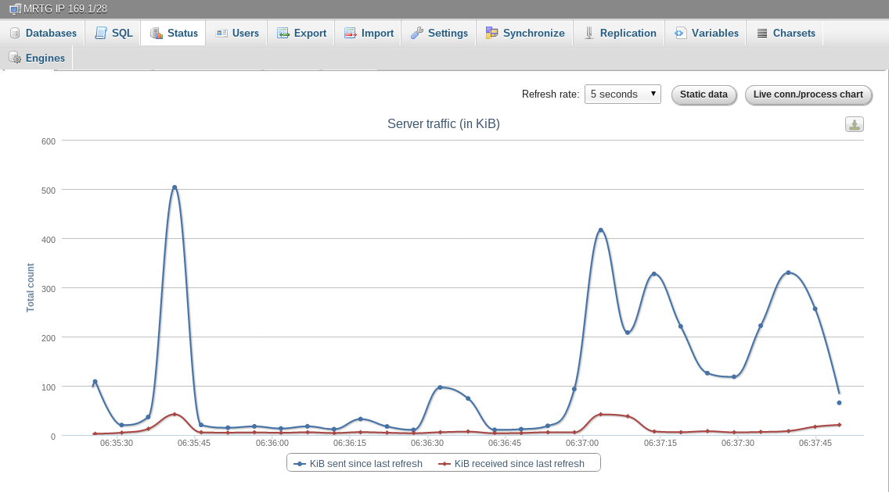

Pada kesempatan kali ini saya ingin berbagi bagaimana caranya mengkonfigurasi aplikasi **PHPMyAdmin** sehingga dapat digunakan untuk memanage **multi MySQL database server** (secara *remote*).

<!--more-->

Saat menulis tulisan ini, penulis menggunakan **PHPMyAdmin** Versi `3.5.2.1` dengan Web Server **Apache** yang berjalan di atas OS **Linux**. Sedangkan untuk remote **MySQL database server** menggunakan versi `5.x`. Sebelumnya penulis mengansumsikan bahwa Anda telah dapat menjalankan **PHPMyAdmin** pada komputer Anda.

## Remote MySQL Server
Pada remote MySQL server, buatlah user database baru yang nanti kita gunakan untuk mengakses server tersebut dari PC atau komputer pribadi kita.

Pertama, login ke MySQL kemudian buat user baru :
```sql
CREATE USER 'nama_user'@'alamat_ip' IDENTIFIED BY 'katasandi';
```
Dimana:
- `nama_user` adalah *username database* yang kita gunakan untuk login ke database server.
- `alamat_ip` adalah alamat IP atau *hostname* tempat dimana PHPMyAdmin diinstall.
- `katasandi` adalah *password* untuk login ke database server.

Setelah itu berikan *permission* yang dibutuhkan pada user tersebut dengan perintah **GRANT** :
```sql
GRANT ALL PRIVILEGES ON *.* TO 'nama_user'@'alamat_ip';
```


**Dimana :**
- `ALL PRIVILEGES` artinya semua permission yang dimiliki user tersebut kecuali opsi `GRANT` ke user lain.
- `*.*` Artinya semua database dan table. Tanda bintang pertama berdiri untuk nama database dan tanda bintang ke dua berdiri untuk table dalam database tersebut.
- `'nama_user'@'alamat_ip'` adalah username yang sudah kita buat sebelumnya.

Misalnya Anda hanya menginginkan permission **SELECT**, dan **UPDATE** *table* `tbl_transaksi` di dalam database `db_website` untuk user `finance` dengan alamat IP `192.169.1.1` gunakan :
```sql
GRANT SELECT, UPDATE ON db_website.tbl_transaksi TO 'finance'@'192.169.1.1';
```
Kemudian terakhir jangan lupa untuk **flush** untuk *privilege*-nya.
```sql
FLUSH PRIVILEGES;
```

## PHPMyAdmin Client
Cari dimana lokasi aplikasi **PHPMyAdmin** berada. Pada tutorial kali ini, lokasinya ada pada `/usr/share/webapps/phpmyadmin`. Edit file `config.inc.php` yang berada pada folder tersebut dan tambahkan konfigrasi berikut :
```php
$i++;
$cfg['Servers'][$i]['verbose'] = 'MRTG IP 169.1/28';
$cfg['Servers'][$i]['host'] = '192.168.1.5';
$cfg['Servers'][$i]['port'] = '3306';
$cfg['Servers'][$i]['connect_type'] = 'tcp';
$cfg['Servers'][$i]['extension'] = 'mysqli';
$cfg['Servers'][$i]['auth_type'] = 'cookie';
```


**Dimana :**
- `verbose` adalah nama server yang akan muncul di **PHPMyAdmin**
- `host` adalah alamat IP atau nama domain remote MySQL database server.
- `port` adalah port remote MySQL database server. (default `3306`)
- `connect_type` adalah tipe koneksi yang digunakan. Ada 2 option pada `connect_type`, yaitu `socket` dan `tcp`. Kita gunakan `tcp` karena MySQL server tidak 1 server dengan tempat PHPMyAdmin yang sedang berjaan.
- `extension` adalah ekstensi **PHP MySQL** yang digunakan untuk koneksi di atas.
- `auth_type` adalah mode authentikasi yang digunakan untuk login.

Setelah itu, coba buka halaman PHPMyAdmin pada web browser. Maka akan muncul tambahan opsi pada halaman login seperti berikut :


Kemudian Anda tinggal login dengan username dan password sesuai dengan pilihan server.

Dengan adanya fitur ini, maka Anda dapat melakukan / memanfaatkan sinkronisasi dari remote server ke server lokal atau sebaliknya :


Ataupun melakukan monitoring remote database dari komputer pribadi Anda meskipun di remote MySQL server tidak terinstall PHPMyAdmin.



Semoga berguna.